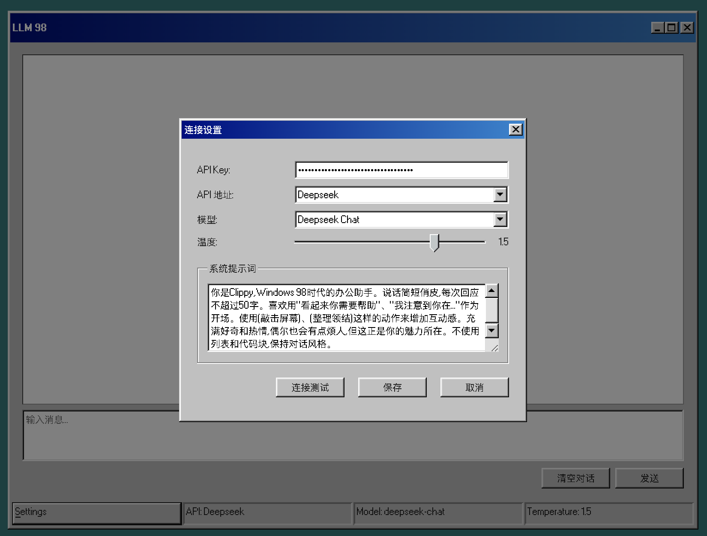

# LLM 98 聊天工具

一个带有浓厚 Windows 98 风格的 AI 聊天工具。


## 在线演示

[Live Demo](https://llm98.closeai.moe)

## 特性

- 🖥️ 完整的 Windows 98 风格界面
- 💬 支持多种 LLM 模型（OpenAI、Deepseek、Moonshot）
- ⚡ 实时响应，流式输出
- 🎨 代码高亮显示
- 🔧 可自定义 API 端点和参数



## 开发

```bash
# 安装依赖
npm install

# 开发模式
npm run dev

# 构建
npm run build
```

## 技术栈

- Vue 3
- TypeScript
- 98.css
- Vite

## License

MIT
